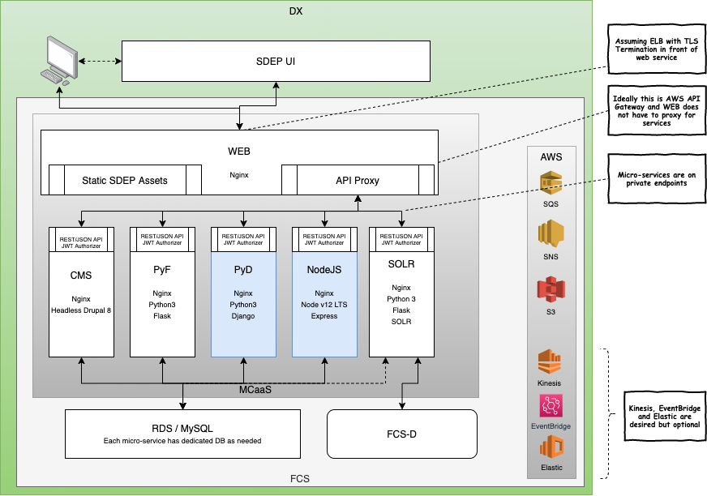

# DX Container Architecture Development Environment

This repo will allow developers to mimic the FCS MCaaS container environment locally.

## Quickstart

Install and configure docker and python

1. Close this repo locally
2. Install localstack: `pip install localstack`
3. Change to this directory: `cd dx-docker`
4. Clone SDEP: `git clone https://github.com/GSA/DX-Entrypoint.git`
5. Build dockerfiles locally:  `docker-compose build`
6. Bring up services: `docker-compose up`

Services:
* DX UI (SDEP): `http://localhost:8080`
  * This is the STATIC version of SDEP, so you have to run `ng build` and refresh your browser if you want to see any changes.  
    `docker-compose` mounts the `dist` directory for nginx so you don't have to do a deploy.
* DX UI Live (SDEP development): `http://localhost:5300`
  * This is the LIVE version of SDEP environment, equivalent to running `ng serve` locally
* CMS-SDEP (Drupal): `http://localhost:8081` 

Utilities:
* PhpMyAdmin: `http://localhost:8888` (user: `root`, password: `password`)

## WEB-SDEP

* Clone SDEP: `git clone https://github.com/GSA/DX-Entrypoint.git`
* Change to the project: `cd DX-Entrypoint`
* Build angular app: `ng build` 

The WEB container is just an nginx container that hosts the statically built angular SDEP application, `WEB-SDEP-LIVE` for development

## CMS-SDEP

A default, un-configured version of Drupal 8 is running at `http://127.0.0.1:8081` 

## RDS-MySQL

The `docker-compose.yml` file defines a container named `rds-mysql` which mimics the AWS provided RDS database with MySQL.  To add additional databases
to your local development environment, edit the `./rds-mysql/create-databases.sh` file (note: use the `.env` file for your configuration!).

## AWS Resources

This project provides (Localstack)[https://github.com/localstack/localstack] versions of SNS, SQS and S3.  All are available on port 4566 and accessible in other containers as AWS endpoint `http://localstack:4566` 